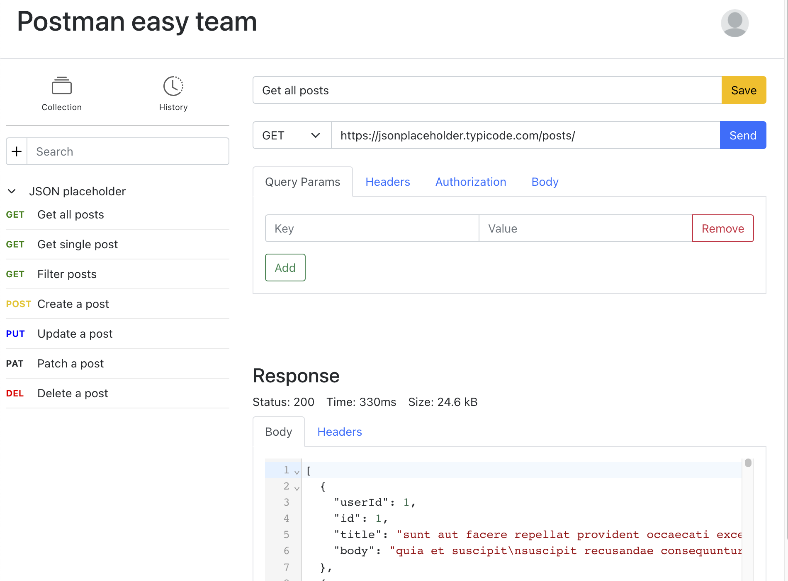

# Postman easy team

Postman is a great app for api testing. However, the price is high for postman team if you have more than 3 people in the team. This project is an easy postman web app that can be used for frontend and backend to test api endpoints. The app use Google firebase storage to store the requests and history and authenticate users with firebase authentication. Teams can test GET, POST, PUT, PATCH, and DELETE requests with request headers, body, paramsters and authentications securely.




## Demo
Demo website: https://postman-easy-team.web.app/

Testing account: test@example.com

Password: 123456

## Installation
```
$ git clone https://github.com/lit26/postman-easy-team
```
### `yarn start`

Runs the app in the development mode.\
Open [http://localhost:3000](http://localhost:3000) to view it in the browser.

The page will reload if you make edits.\
You will also see any lint errors in the console.

### `yarn test`

Launches the test runner in the interactive watch mode.\
See the section about [running tests](https://facebook.github.io/create-react-app/docs/running-tests) for more information.

### `yarn build`

Builds the app for production to the `build` folder.\
It correctly bundles React in production mode and optimizes the build for the best performance.

The build is minified and the filenames include the hashes.\
Your app is ready to be deployed!

## Firebase

We are using Firebase to store the collections and history and authenticate user. In the [Firebase console](
https://console.firebase.google.com
), create a project and setup the authentication and firestore database. 

## Authentication
This app only allow signin, signout, and change password. The administrator can add user on firebase console.

## Deploy (optional)

## Install Firebase

Go to your local terminal

```
npm install -g firebase-tools
```
### Login in to your firebase on local terminal
```
firebase login
```
Select the gmail account with firebase

### Deploy app
```
firebase init
```
Choose `Hosting: Configure and deploy Firebase Hosting sites` for hosting web apps (Be aware use `spacebar` to select option)

Choose the option (ex: Use an existing project, Create a new project, etc...)

What do you want to use as your public directory?
```
build
```

Deploy app
```
npm run build
firebase deploy
```

## Reference

- [React Authentication Crash Course With Firebase And Routing](https://www.youtube.com/watch?v=PKwu15ldZ7k)
- [Stop Using Postman - Create Your Own Postman Instead](https://www.youtube.com/watch?v=qQR0mfFGRmo)
